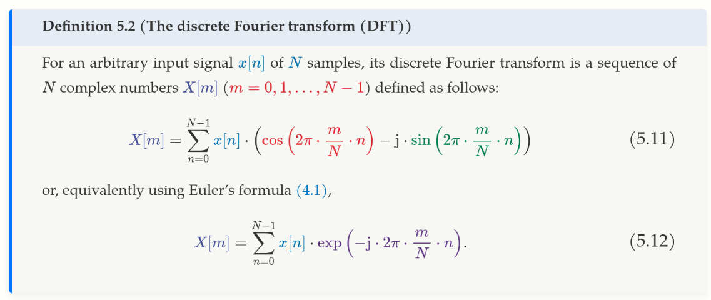

# Digital Signals Theory Notes

## Overview

These are notes based on the content of [the DST book](https://brianmcfee.net/dstbook-site/content/ch05-fourier/Cosine.html), by Brian McFee.

## The Frequency Domain

### Comparing to Sinusoids

Some definition refreshers:

- Nyquist-Shannon sampling theorem: sample rate must be at least twice the
  bandwidth of the sampled signal to avoid aliasing artifacts.
- Band-limited signal: a signal whose frequencies are reduced/limited outside of a
  certain frequency range.

Key concepts:

- Analysis frequency: any frequency $f$ which exactly completes an integer number
  of cycles $m$ in $N$ samples.
  - i.e., their period is an integer multiple of the period of the wave which
    we are analysing. If we consider the signal we are analysing, and extend
    that signal to be infinite, then it will not matter which repetition
    of the signal we analyse, as the analysis frequency is an integer
    multiple.
  - Guaranteed to produce the same similarity score no matter which repetition
    of the signal we choose to analyse.
  - We want to find the *minimal amount of analysis frequencies* which can
    accurately represent our signal.
  - Again, fundamentally: an analysis frequency can be defined by how many of
    its full cycles can be completed over the given duration (of the frequency
    we are analysing = $N$ samples).
- By nature of its definition, there are inherently a **limited amount of
  analysis frequencies**, as the frequency must fully complete by the $N^{\text{th}}$ sample
- $m = \frac{cycles}{signal-duration}$.

Key elements of this section:

  1. Assume that a signal $x[n]$ of $N$ samples represents *one* observation of
     an infinitely repeating loop.
  2. Analysis frequencies complete a whole number of cycles in $N$ samples.
  3. We can represent a signal $x$ according in terms of its similarity to
     sinusoids at our chosen analysis frequencies.

### Analysis frequencies

Spectral leakage: a wave at a non-analysis frequency will *leak* across the
entire frequency range, and appear to be a little similar to each
analysis frequency.

Reminder:

- $m$ = cycles / signal-duration of the analysis frequency. (how many analysis
  signals can we fit in to our reference signal).

For a given analysis frequency, we can consider a collection of reference
signals. The collection of reference signals can be given by:

$$
y_m[n] = cos(2 \pi \times \frac{m}{n} \times n)
$$

However, the resulting similarity scores, if we compare to this signal,
will **depend on the phase of our signal**, and **whether or not its frequency is an
analysis frequency**.

- In the worst, case (if our input signal is $x[n] = sin(2 \pi \times \frac{m}{N} \times n)$)
  then our similarity score will be $0$, **even if the frequency exactly matches
  one of the reference signals**.

### Phase

Concerns of phase can mean that a signal can have exactly the same *frequency*
as one of the reference signals, but still produce a similarity score of 0
because of mis-aligned phases.

### The Discrete Fourier Transform

Digital version of the Fourier Transform.

Recall that:

- With our similarity score approach as discussed previously, phase misalignment
  can mean that even where our frequency matches our reference signal, the
  similarity score may be 0. E.g., comparing a sine and cosine wave.
- We could fix the original issue by changing our comparison wave to a cosine
  instead of sine wave. However, then we would get the same issue but in reverse.

When we compare simultaneously to a sine and cosine wave:

- Both cannot simultaneously be 0.

This holds for any given period, at a specific analysis frequency.

So, to define the Discrete Fourier Transform:

- the DFT takes as an input a signal $x[n]$ of $N$ samples, and produces a
  sequence $X[M]$ of $N$ complex numbers representing amplitude and phase for
  each analysis frequency.
  

Remember, with $X[m]$:

- $m$ refers to number of completed cycles of the analysis frequency divided by
  the total signal duration (in samples, not seconds, given this is discrete).
  - A different value of $m$ is going to give you a different frequency, althout
    $m$ itself is not a frequency (in terms of *Hz*).
- $X[m]$ is a **sequence of complex numbers**, where each complex number represents
  the **amplitude and phase** for each analysis frequency. 
- That is, each $X[m]$ measures the contribution of a sinusoid at a particular
  frequency to **the entire signal**.

**Current things to clarify:**

- For each complex value inside of $X[m]$, what does each part of the complex
  value represent in terms of the resulting waveform?
  - Thinking intuitively about what we actually are interested in, we want
    each value to have one of the composite analaysis frequencies of our wave,
    and then have some sort of representation of 'how much' of the final
    wave it makes up.

  ## Frequency Domain Convolution

  **The Convolution Theorem**: the DFT of a convolution of two input waves
  is equivalent to the product of the DFTs of the two input waves.

  ### Low-pass filters

  A (non-ideal) way to create a low-pass filter is to average sample values
  together over a short window of time, known as a *moving average filter*.

  - High frequencies oscillate within the time window, and therefore average
    to zero. Low frequencies will not.
  - This filter would operate within the time domain.
  - We can analyse the effect of this filter approach by analysing the results
    of the DFT on it. We then look at the magnitude of the resulting wave.
    We can see that the curve actually has some ripples with this approach,
    leading some higher frequencies to be less attenuated than some lower
    frequencies.

  "Ideal" low-pass filter

  - Start in the frequency domain
  - Have our system's impulse response be h\[m\].
  - Set H\[m\] = 0 where `m` is above our cutoff frequency for the low-pass filter,
    and set H\[m\] = 1 where it is below.
  - This implementation has an issue:
    - The time-domain representation of the impulse response of this "ideal"
      low-pass filter oscillates around 0, and is a periodic wave.
    - These oscillations produce audible artifacts, known as **ringing**, when
      the IR is convolved with a signal.
    - These occur because sharp edges are difficult to represent by continuous
      sinusoids (both in the frequency and the time domain). Because the ideal
      filter is infinitely sharp, it requires infinitely many samples to represent
      in the time domain. Any finite approximation will produce ringing
      artifacts.
    - Because of ringing, ideal low-pass filters are almost never used in
      practice.

Filter design:

- Terminology:
  - Pass-band: frequencies allowed through the filter
  - Stop-band: frequencies stopped by the filter
  - Transition band: frequencies affected by the filter, but still audible.
- Different trade-offs exist, and need to be made when designing a filter. We
  want to maximise:
  - High stop-band attenuation (filter stops frequencies when it should)
  - Small pass-band ripple (passing frequencies not too distorted).
  - Narrow transition band (filter efficiently moves from pass to stop behaviour).

## Analysing IIR filters

Transfer functions:

- Can be thought of as a generalisation of convolution theorem to support
  feedback filters (IIR filters).
- If we are dealing with FIR filters, we can examine the DFT $H\[m\]$ of the
  impulse response $h\[k\]$. This analysis cannot be applied to IIR filters,
  as there is no defined IR length. The transfer function $H\[z\]$ is like
  $H\[m\]$, except it is from the perspective of the z-Transform, not the
  DFT.

Poles and zeroes:

- In a general sense:
  - frequencies near zeroes are attenuated
  - frequencies near the poles are amplified.

