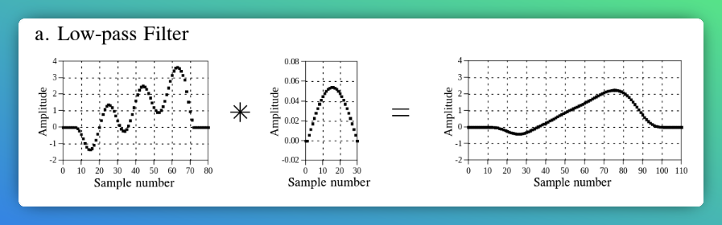

# The Scientist and Engineers Guide to DSP

## DSP Software

Number precision:

- Floating point numbers: the gaps between adjacent numbers vary over the represented number range.
  - Large numbers have large gaps between them. Small numbers have small gaps between them.

## Linear Systems

What is a linear system?

- **Homogeneity**: 
- **Additivity**: 
- **Shift invariance**:

Two important properties of linear systems:

1. Static linearity:
2. Sinusoidal fluidity:

Special properties of linearity:

- 

**Superposition**: Signal being processed is broken into simple components, each component processed individually, results reunited.

- Only possible with *linear* systems.

Decompositions:

- **Impulse decomposition**: Break N samples signal ito N component signals, each containing N samples
  Remainder of values are 0. A single nonzero point in a string of zeros is an impulse.
  - Important because allows signals to be examined *one sample at a time*.
  - Knowing how a system responds to an impulse, system's output can be calculated
    for a given input. This is called **convolution**.
  - Maybe try to conceptualise it like this:
    - You have a discrete sampled signal. Say, 20 samples in the signal we are looking at.
    - This sampled signal is plotted on a graph, where the x axis has 20 discrete points (duh).
    - Individually, grab the value of each sample.
    - For each sample, create a new graph, which also has 20 discrete points on its x axis.
    - Place each sample on its respective graph, and then fill in each other of the 1samples9 remaining
      points with 0.
    - I.e., you will end up with 20 graphs, each with a single point with a non-0 value, and 19
      zeroed values. For each graph, the point with a value is the impulse.
  - This lets us analyze signals one sample at a time.
- **Fourier decomposition**: *Very* mathematical. TODO

## Convolution

Some basic terms:

- **Delta function**: a *normalized* impulse. I.e., sample number zero has a value of one,
  all other samples have a value of zero. Also called the *unit impulse*.
  - Impulse can be represetned as a shifted+scaled delta function
- **Impulse response**: Signal that exits a system when a delta function (unit impulse)
  is the input.
  - Usually given the symbol **h[n]**.
  - **If you know a system's impulse response, you know how it will react to *any* impulse**.
  - That is, if you know a system's impulse response, you know *everything* about a linear
    system's characteristics.

Impulse response has different names in different contexts:

- Filters = filter kernel/convolution kernel/kernel.

Convolution is a formal mathematical operation: takes two signals, produces a third signal.

- Describes the relationship between the input signal, output signal and impulse response.
- Convolution is represented by a star formally: $\circledast$.

For example, a low-pass filter would look like this:

Length of the output signal = `length of the input signal` + `length of impulse response - 1`

TODO (notes on how to actually do this in practice)

- See p 112 (the input side algorithm)
